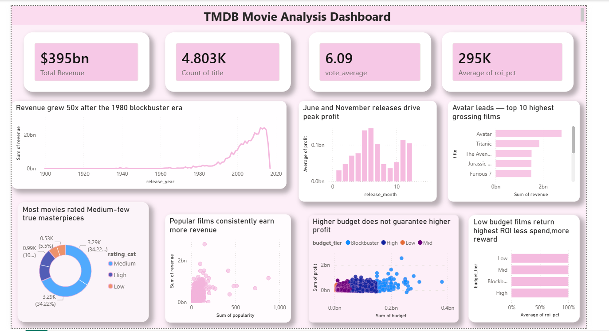

🎬 TMDB Movie Analysis — Python + Power BI

End-to-end data analysis of 4,806 movies from the TMDB dataset.
Explored revenue trends, ROI by budget, and popularity patterns.

## 🔍 Questions Answered
1. Which budget tier gives the best ROI? → Low-budget films return 2x more
2. Does popularity drive revenue? → 0.6 correlation found
3. Which month earns the most? → June and November peak

## 📊 Tools Used
Python · pandas · matplotlib · Power BI Desktop

## 📁 Files
- `tmbd_movie.ipynb` — full Python analysis
- `dashboard_screenshot.png` — Power BI dashboard
- `tmdb_5000_movie_clean.csv` — cleaned dataset

## 💡 Key Findings
- Revenue grew 50x from 1980 to 2015 (blockbuster era effect)
- Low-budget films: ~420% ROI vs Blockbusters: ~220% ROI
- Avatar leads all-time with $2.7B box office revenue
